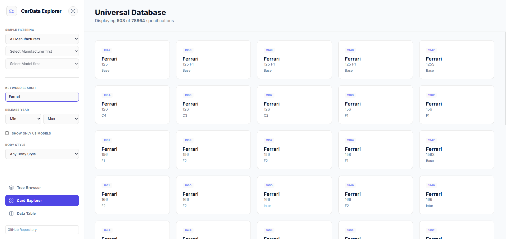

# CarData Explorer

CarData Explorer is a premium, high-performance web application designed for browsing and searching through a vast database of over 78,000 car specifications. Extracted from the CarQuery API, the application features an optimized data architecture to ensure lightning-fast performance and a seamless user experience.

### [Live Demo](https://imamhossain94.github.io/cardata-explorer/)



---

## Key Features

*   **Tree Browser**: Explore the car hierarchy structurally by **Make > Model > Trim**.
*   **Data Table View**: A professional-grade table for high-density data viewing with sticky headers and zebra striping.
*   **Card Grid View**: A modern, visual way to explore car models.
*   **Advanced Filtering**: Filter by keyword and release year range.
*   **Dual Theme Support**: High-contrast Dark and Light modes with persistent user preferences.
*   **Premium UI**: Built with a minimalist, outline-only aesthetic using **Lucide Icons** and the **Inter** typeface.
*   **Fully Responsive**: Optimized for browsing on desktops, tablets, and mobile devices.

## Optimized Data Architecture

To maintain high performance while handling large datasets, this project uses a multi-tier data strategy:

1.  **Global Index (`web_data/index.json`)**: A compact 3.8MB index used for instant searching, filtering, and the initial Tree/Grid views.
2.  **Detail Fragments**: Deep technical specifications are lazy-loaded from separate JSON files per manufacturer in `web_data/details/` only when a user requests "View Specs."
3.  **Raw Data Support**: For heavy processing, the project includes raw datasets in the `raw_data/` directory:
    *   `make_model_trim_compact.json` (3.7MB)
    *   `make_model_trim_detailed.json` (132MB+)
4.  **Static Speed**: Designed to be hosted on any static hosting platform (like GitHub Pages) without needing a database server.

## Technology Stack

*   **Frontend**: Vanilla HTML5, CSS3, JavaScript (ES6+)
*   **Icons**: [Lucide Icons](https://lucide.dev/)
*   **Fonts**: [Inter](https://fonts.google.com/specimen/Inter)
*   **Data Source**: [CarQuery API](https://www.carqueryapi.com/)

## Local Development

Since the application uses `fetch()` to load JSON data, it must be run through a local server due to browser security (CORS) policies.

1.  **Clone the repository**:
    ```bash
    git clone https://github.com/imamhossain94/cardata-explorer.git
    cd cardata-explorer
    ```

2.  **Run a local server**:
    *   Using **Node.js**: `npx serve .`
    *   Using **Python**: `python -m http.server 8000`

---

## Acknowledgments

*   Data provided by the [CarQuery API](https://www.carqueryapi.com/).
*   Icons provided by [Lucide](https://lucide.dev/).

---
Developed by [Imam Hossain](https://github.com/imamhossain94)
